# Expense Management System

A full-stack MERN expense tracker with JWT cookie authentication, demo sessions, transaction filtering, and rich analytics.

**Live demo:** [expense-management-system-bice.vercel.app](https://expense-management-system-bice.vercel.app/login)

**Design (Google Stitch):** [View Stitch Project →](https://stitch.withgoogle.com/projects/8842764260137375966)

---

## Tech Stack

| Layer | Technology |
|---|---|
| Frontend | React 18, Ant Design v5, Recharts, Axios, React Router v6, Day.js |
| Backend | Node.js, Express, express-rate-limit, Morgan |
| Database | MongoDB + Mongoose |
| Auth | JWT (httpOnly cookie) + bcryptjs |
| Deployment | Vercel (frontend), Render (backend API) |

---

## Features

- Register & login with secure JWT httpOnly cookie auth
- **Demo mode** — try the app instantly with pre-seeded transactions, no account needed
- Add, edit, delete transactions (amount, type, category, date, description)
- Filter by frequency: last 7 days / 30 days / 1 year / custom date range
- Filter by transaction type: All / Income / Expense
- KPI summary cards: Total Balance, Total Income, Total Expense
- **Analytics view** with three interactive Recharts visualisations:
  - Area chart — income vs expense over time
  - Donut chart — income vs expense split
  - Horizontal bar chart — category-level breakdown
- Password update from the profile dropdown
- Demo data reset ("Clear Demo Data") for demo sessions
- Rate-limiting on auth endpoints (express-rate-limit)
- TTL-based automatic cleanup of demo accounts via MongoDB TTL index
- Fully responsive — desktop, tablet & mobile

---

## Project Structure

```
Expense-Management-System/
├── client/                     # React frontend (Create React App)
│   ├── public/
│   └── src/
│       ├── components/
│       │   ├── Analytics.js        # Recharts area / donut / bar charts
│       │   ├── ErrorBoundary.js    # React error boundary wrapper
│       │   ├── FilterBar.js        # Frequency, type filter + view toggle
│       │   ├── Spinner.js          # Loading spinner
│       │   ├── transactionModal.js # Add / edit transaction modal
│       │   └── Layout/
│       │       ├── Header.js       # App header with avatar dropdown
│       │       ├── Footer.js
│       │       └── Layout.js
│       ├── pages/
│       │   ├── HomePage.js         # Main dashboard (KPI cards + table/analytics)
│       │   ├── Login.js            # Login page with demo login button
│       │   └── Register.js
│       └── utils/
│           └── categories.js       # Shared transaction category list
├── server/                     # Express backend
│   ├── controllers/
│   │   ├── transactionCtrl.js  # CRUD + delete-all-transactions
│   │   └── userController.js   # Register, login, logout, demo, password update
│   ├── middleware/
│   │   └── authMiddleware.js   # JWT cookie verification
│   ├── models/
│   │   ├── transactionModel.js
│   │   └── userModel.js        # TTL index on expiresAt for demo cleanup
│   ├── routes/
│   │   ├── transactionRoutes.js
│   │   └── userRoute.js        # Rate-limited auth routes
│   ├── scripts/
│   │   └── seedTransactions.js
│   └── utils/
│       └── demoData.js         # Pre-seeded demo transaction generator
├── docs/
│   └── screenshots/
│       ├── v1/                 # Original UI screenshots
│       └── v2/                 # Redesigned UI screenshots
└── render.yaml                 # Render static deployment config
```

---

## Getting Started

### Prerequisites
- Node.js >= 16
- MongoDB (local or Atlas)

### 1. Clone the repo

```bash
git clone https://github.com/RaviPandey2002/Expense-Management-System.git
cd Expense-Management-System
```

### 2. Setup server

```bash
cd server
cp .env.example .env   # fill in your values
npm install
npm run dev
```

**Server `.env` variables:**

```env
PORT=8000
MONGO_URL=your_mongodb_connection_string
JWT_SECRET=your_jwt_secret
CLIENT_URLS=http://localhost:3000
NODE_ENV=development
```

> **Note:** The server defaults to port **8000**. Keep `PORT` in `.env` and `REACT_APP_API_BASE_URL` in the client `.env.development` in sync.

### 3. Setup client

```bash
cd client
npm install
npm start
```

**Client `.env.development` variable:**

```env
REACT_APP_API_BASE_URL=http://localhost:8000/api/v1
```

---

## API Overview

| Method | Endpoint | Auth | Description |
|---|---|---|---|
| `POST` | `/api/v1/users/register` | ✗ | Create a new account |
| `POST` | `/api/v1/users/login` | ✗ | Login & receive JWT cookie |
| `POST` | `/api/v1/users/logout` | ✗ | Clear JWT cookie |
| `POST` | `/api/v1/users/demo-login` | ✗ | Start a 2-hour demo session |
| `PUT` | `/api/v1/users/update-password` | ✓ | Change account password |
| `POST` | `/api/v1/transactions/get-transactions` | ✓ | Fetch filtered transactions |
| `POST` | `/api/v1/transactions/add-transaction` | ✓ | Add a transaction |
| `POST` | `/api/v1/transactions/edit-transaction` | ✓ | Edit a transaction |
| `POST` | `/api/v1/transactions/delete-transaction` | ✓ | Delete a transaction |
| `POST` | `/api/v1/transactions/delete-all-transactions` | ✓ Demo | Clear all demo transactions |
| `GET` | `/health` | ✗ | Backend health check |

---

## Design Process

This project was visually redesigned using **Google Stitch**, an AI-assisted UI design tool.

The original UI (v1) screenshots are preserved in [`docs/screenshots/v1/`](docs/screenshots/v1/) and the new v2 design in [`docs/screenshots/v2/`](docs/screenshots/v2/) for clear before/after comparison.

| Version | Description | Link |
|---|---|---|
| v1 | Original UI — functional but basic | See [`docs/screenshots/v1/`](docs/screenshots/v1/) |
| v2 | Redesigned UI — Google Stitch assisted | [Stitch Project →](https://stitch.withgoogle.com/projects/8842764260137375966) |

> **Why document this?** Tracking design iterations shows a professional development workflow — from working software → clean code → polished UI.

---

## Screenshots

### v1 — Original Design

<table>
  <tr>
    <td align="center"><strong>Login Page</strong></td>
    <td align="center"><strong>Dashboard</strong></td>
  </tr>
  <tr>
    <td>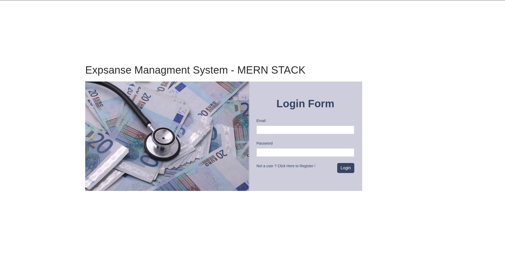</td>
    <td>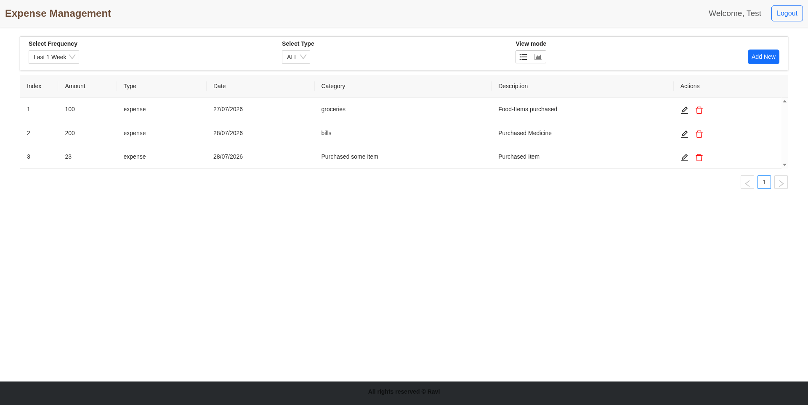</td>
  </tr>
  <tr>
    <td align="center"><strong>Add Transaction</strong></td>
    <td align="center"><strong>Analytics</strong></td>
  </tr>
  <tr>
    <td>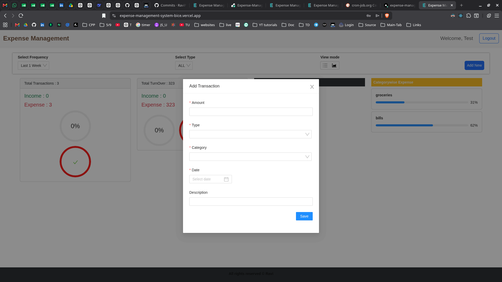</td>
    <td>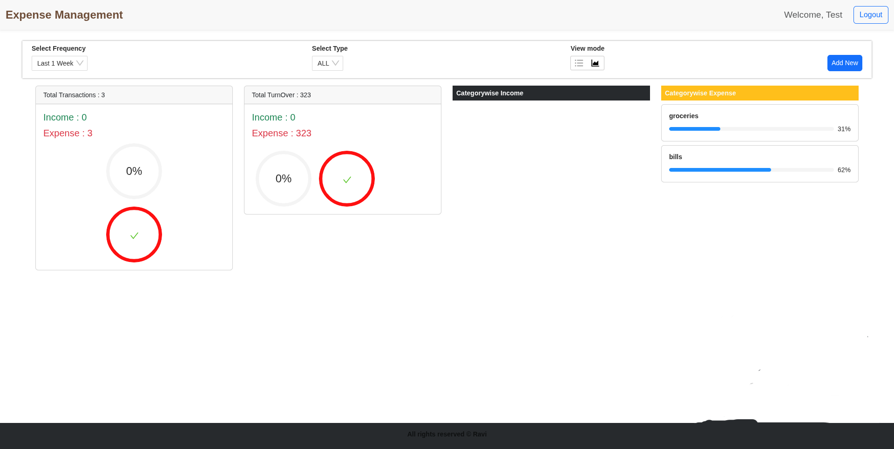</td>
  </tr>
</table>

---

### v2 — Redesigned UI (Google Stitch)

#### Desktop

<table>
  <tr>
    <td align="center"><strong>Login Page</strong></td>
    <td align="center"><strong>Register Page</strong></td>
  </tr>
  <tr>
    <td>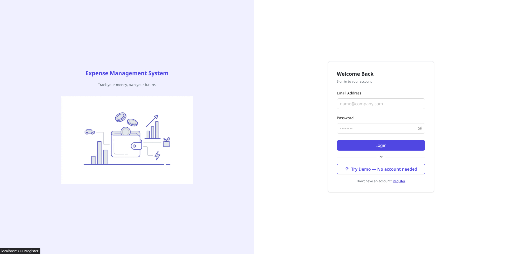</td>
    <td>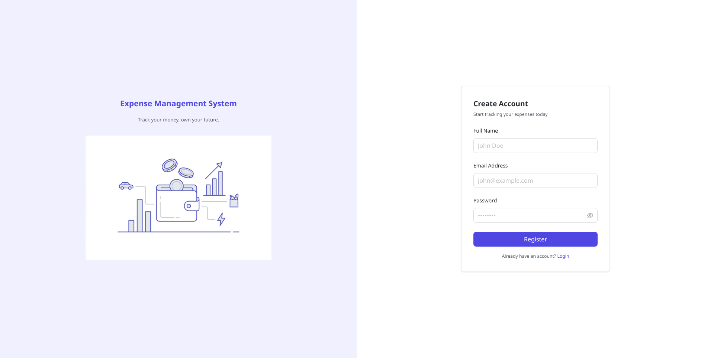</td>
  </tr>
  <tr>
    <td align="center"><strong>Normal User Dashboard</strong></td>
    <td align="center"><strong>Demo User Dashboard</strong></td>
  </tr>
  <tr>
    <td>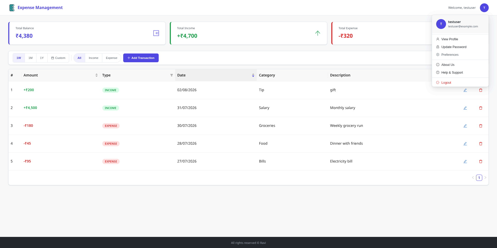</td>
    <td>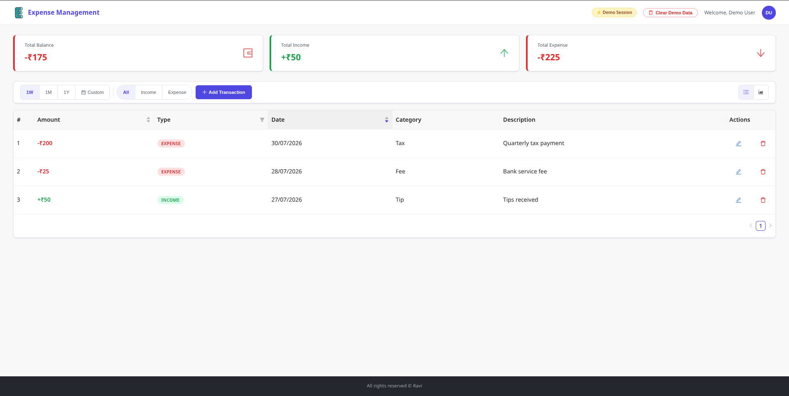</td>
  </tr>
  <tr>
    <td align="center"><strong>Transaction Modal</strong></td>
    <td align="center"><strong>Analytics Page</strong></td>
  </tr>
  <tr>
    <td>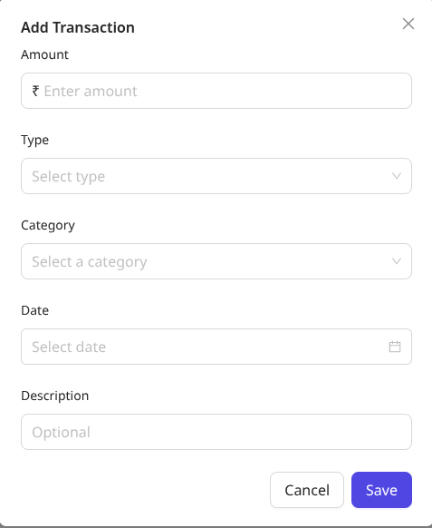</td>
    <td>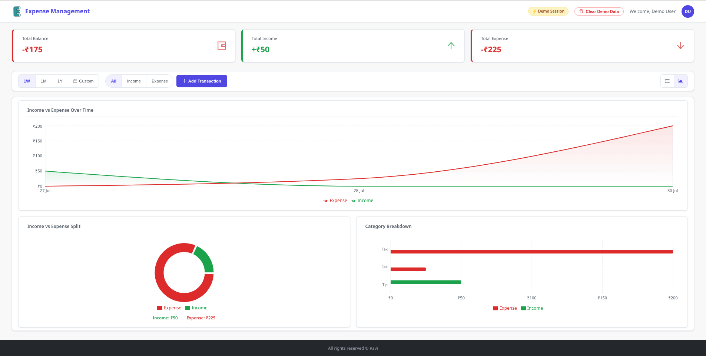</td>
  </tr>
</table>

#### Mobile

<table>
  <tr>
    <td align="center"><strong>Login</strong></td>
    <td align="center"><strong>Register</strong></td>
    <td align="center"><strong>Dashboard</strong></td>
  </tr>
  <tr>
    <td>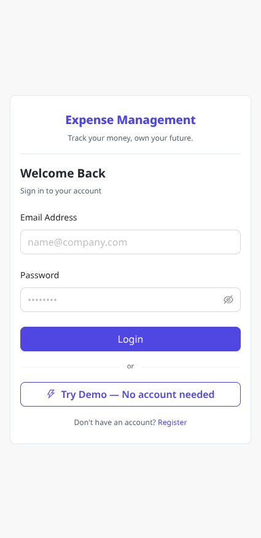</td>
    <td>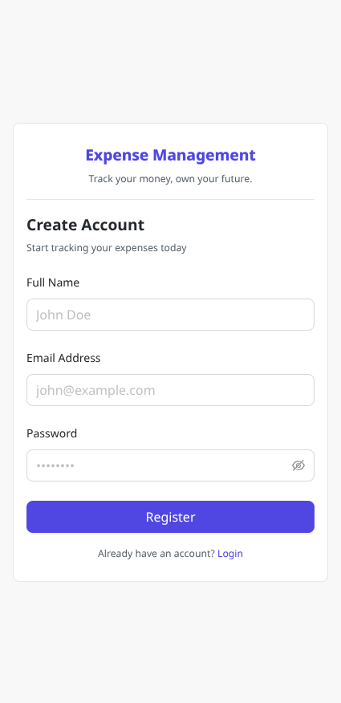</td>
    <td>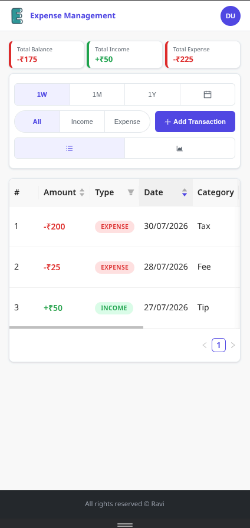</td>
  </tr>
  <tr>
    <td align="center"><strong>Transaction Modal</strong></td>
    <td align="center"><strong>Analytics 1</strong></td>
    <td align="center"><strong>Analytics 2</strong></td>
  </tr>
  <tr>
    <td>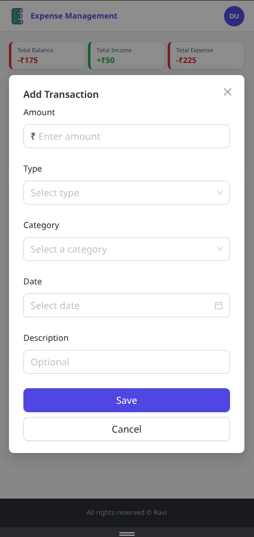</td>
    <td>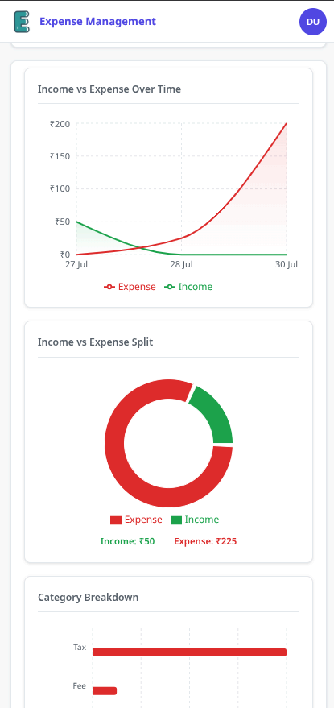</td>
    <td>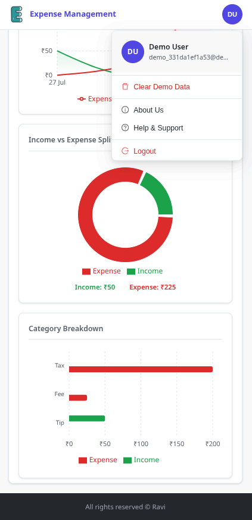</td>
  </tr>
</table>

---

## Contributing

1. Fork the project
2. Create your feature branch: `git checkout -b feature/your-feature`
3. Commit your changes: `git commit -m 'feat: add your feature'`
4. Push to the branch: `git push origin feature/your-feature`
5. Open a Pull Request

---

## License

Distributed under the [MIT License](LICENSE).

---

## Contact

**Ravi Pandey**  
- LinkedIn: [linkedin.com/in/ravi-pandey-52a20b217](https://www.linkedin.com/in/ravi-pandey-52a20b217/)
- Email: Ravi2001pandey@gmail.com
- GitHub: [github.com/RaviPandey2002/Expense-Management-System](https://github.com/RaviPandey2002/Expense-Management-System)
